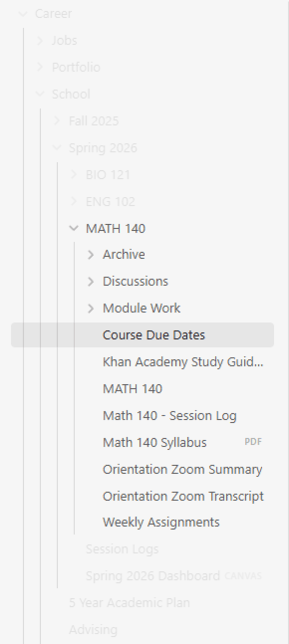
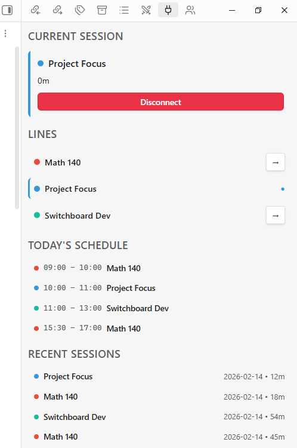
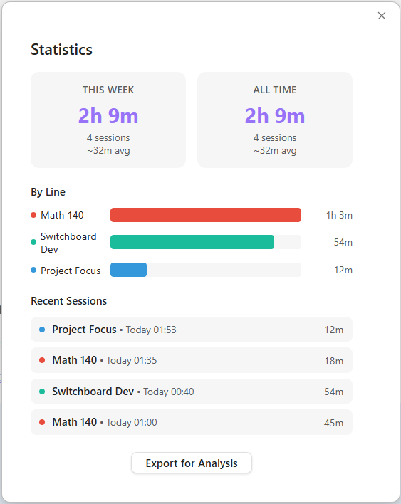

# Switchboard

**Context manager for the distracted brain.** Patch into your focus.

Switchboard reduces context-switching friction by visually transforming your Obsidian vault based on what you're working on. Define your contexts ("Lines"), patch in, and let Switchboard fade away everything else so you can focus on what matters.

<p align="center">
  
</p>

---

## Features

### 🔌 Signal Isolation
When you "patch in" to a Line, Switchboard fades out folders that aren't relevant to your current context and shifts Obsidian's accent color to match your Line. Your vault becomes a focused workspace in one keystroke.

### 📋 Operator Menu
Each Line can have its own set of quick-action commands: open specific files, run Obsidian commands, or insert templates. One hotkey opens your context-specific toolbox.

### ⏱️ Session Tracking
Switchboard tracks how long you spend in each context. Sessions are logged to dedicated files and optionally to your daily note, so you always have a record of where your time went.

### 📊 Statistics Menu
View session history across all your Lines with summary stats, per-line breakdowns, and CSV export for external analysis.

### 📅 Scheduled Blocks
Set up time blocks for each Line (recurring or one-time). Switchboard will notify you when a block starts.

### ⚡ Line Switcher
Instantly jump between Lines with a keyboard-driven switcher, no mouse required.

### 🎯 Session Goals
Optionally set a goal when you patch in. Switchboard reminds you of it in the status bar and asks if you accomplished it when you disconnect.

### 🖥️ Sidebar Dashboard
A sidebar view showing your current session, all available Lines, today's schedule, and recent session history at a glance.

### 🔔 Break Reminders
Configurable reminders to take breaks during long sessions, because your brain needs to focus on rest too.

<p align="center">
  
  &nbsp;&nbsp;&nbsp;&nbsp;
  
</p>
<p align="center">
  <em>Sidebar Dashboard &nbsp;|&nbsp; Statistics Menu</em>
</p>

### 🎵 Audio Feedback
Satisfying click sounds on patch-in and disconnect. Mute toggle available in settings.

### 📓 Daily Note Integration
Optionally log sessions to your daily note when you disconnect, giving you a natural record of your day's focus without any extra effort. Disabled by default.

### 🐛 Debug Mode
Built-in debug logging for troubleshooting. Disabled by default, but you may be asked to enable this when submitting bug reports to help diagnose issues.

---

## Installation

Switchboard is available via [BRAT](https://github.com/TfTHacker/obsidian42-brat) (Beta Reviewers Auto-update Tester).

1. Install the **BRAT** plugin from Obsidian's Community Plugins browser if you haven't already
2. Open BRAT settings (Settings → BRAT)
3. Click **"Add Beta Plugin"**
4. Enter the repository URL:
   ```
   https://github.com/thuban87/Switchboard
   ```
5. Click **"Add Plugin"**
6. Enable **Switchboard** in Settings → Community Plugins

BRAT will automatically keep the plugin updated when new versions are released.

> [!WARNING]
> **Beta Software:** Switchboard is currently in beta and available via BRAT. While stable for daily use, you may encounter occasional bugs. Please back up your vault regularly and [report issues on GitHub](https://github.com/thuban87/Switchboard/issues).

---

## Getting Started

### 1. Create Your First Line

A **Line** is a context: a subject, project, or area of focus.

1. Go to **Settings → Switchboard**
2. Click **"Add Line"**
3. Give it a name (e.g., "Math 140" or "Writing")
4. Pick a color, this becomes your accent color when patched in
5. Set **Safe Paths**, the folders relevant to this context (everything else will be faded)
6. Optionally set a **Landing Page**, the file that opens when you patch in
7. Save

### 2. Patch In

Click the **plug icon** (🔌) in the ribbon, or use the command palette: `Switchboard: Patch In`. Select your Line and you're in.

You'll notice:
- The accent color shifts to your Line's color
- Non-relevant folders fade out (but still accessible like always)
- Your landing page opens (if set)
- The status bar shows your Line name and a running timer

### 3. Disconnect

When you're done, click the **plug icon** again or run `Switchboard: Disconnect`. If your session was 5+ minutes, you'll be prompted to write a quick summary (Call Log) that gets appended to your session log. This can be skipped if you'd rather not log anything.

### 4. Explore

- **Operator Menu** (`Switchboard: Operator Menu`): Your context-specific command panel
- **Line Switcher** (`Switchboard: Line Switcher`): Jump between Lines instantly
- **Dashboard** (`Switchboard: Open Dashboard`): See everything at a glance
- **Statistics** (`Switchboard: Statistics`): Review your session history
- **Speed Dial**: Assign hotkeys to specific Lines via Settings → Hotkeys → search "Switchboard"

---

## Configuration

All settings are under **Settings → Switchboard**:

| Setting | Description |
|---------|-------------|
| **Lines** | Create, edit, and delete your contexts |
| **Call Log** | Toggle session summary prompts on disconnect |
| **Session Goals** | Toggle goal prompts on patch-in |
| **Daily Note Logging** | Log sessions to your daily note |
| **Break Reminders** | Set reminder interval (minutes) |
| **Audio** | Toggle sound effects |
| **Debug Mode** | Enable detailed logging for troubleshooting |

---

## Requirements

- **Obsidian** version **1.10.0** or later

---

## License

[MIT](LICENSE) © 2026 Brad Wales
