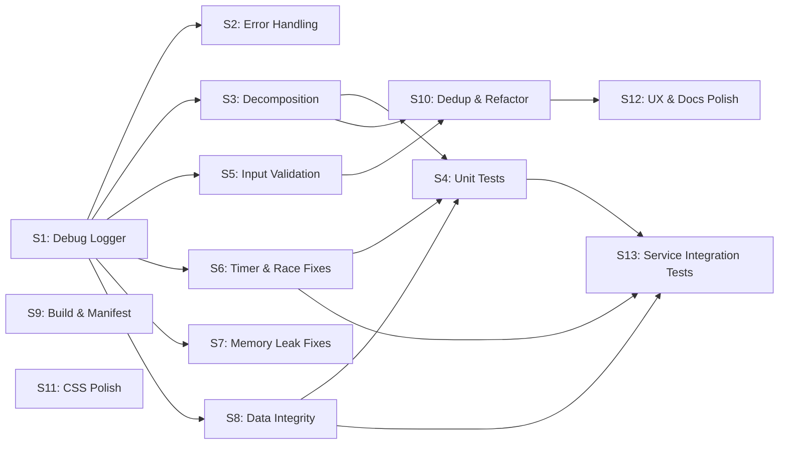

# Master Pre-Launch Implementation Plan

**Goal:** Address every finding from the Full Codebase Audit (56 items) + Independent Review (5 items) = **61 total items** across **13 sessions**.

**Total estimated effort:** ~14 hours

---

## Audit Item Cross-Reference

Every audit finding is assigned to exactly one session. Nothing is left out.

| Audit # | Summary | Session | Priority |
|---|---|---|---|
| 1 | ✅ `audioService.destroy()` not called in `onunload()` | **S3** | CRITICAL |
| 2 | ✅ `breakReminderTimer` / `autoDisconnectTimer` not cleared in `onunload()` | **S3** | CRITICAL |
| 3 | ✅ `sessionLogFile` path traversal — no validation | **S5** | CRITICAL |
| 4 | ✅ `OperatorModal.executeCommand()` — no try-catch, `as any`, null access | **S2** | CRITICAL |
| 5 | `obsidian` dependency set to `"latest"` | **S9** | CRITICAL |
| 6 | ✅ Array index closure bug in delete buttons | **S5** | CRITICAL |
| 7 | ✅ Snooze/Decline race condition | **S6** | HIGH |
| 8 | Session history unbounded growth | **S8** | HIGH |
| 9 | ✅ `saveToCallWaiting()` not awaited | **S2** | HIGH |
| 10 | ✅ `parseTaskTime()` no validation — invalid dates cause immediate setTimeout | **S6** | HIGH |
| 11 | ✅ Daily note heading insertion null access | **S2** | HIGH |
| 12 | ✅ `navigator.clipboard.writeText()` not awaited | **S2** | HIGH |
| 13 | ✅ No time/date validation on scheduled block inputs | **S5** | HIGH |
| 14 | ✅ No duplicate Line ID detection on creation | **S5** | HIGH |
| 15 | ✅ `validate()` shows no error feedback | **S5** | HIGH |
| 16 | ✅ HTMLAudioElement memory leak — new `Audio()` per play | **S7** | HIGH |
| 17 | `isDesktopOnly: false` — mobile untested | **S9** | HIGH |
| 18 | `minAppVersion: "1.0.0"` — too old | **S9** | HIGH |
| 19 | Empty `authorUrl` in manifest | **S9** | HIGH |
| 20 | ✅ Chronos startup `setTimeout(2000)` untracked | **S6** | HIGH |
| 21 | `formatDuration()` duplicated in 6 files | **S10** | MEDIUM |
| 22 | `formatTime12h()` duplicated in 2 files | **S10** | MEDIUM |
| 23 | ✅ No color validation utility | **S5** | MEDIUM |
| 24 | Heading detection uses `indexOf()` — substring not line-aware | **S8** | MEDIUM |
| 25 | Concurrent session logging race condition | **S8** | MEDIUM |
| 26 | Timezone inconsistency — UTC in history, local in daily notes | **S8** | MEDIUM |
| 27 | ✅ IncomingCallModal double-click race on action buttons | **S6** | MEDIUM |
| 28 | PathSuggest full vault scan per keystroke — no debounce | **S12** | MEDIUM |
| 29 | tsconfig target ES6 mismatches esbuild ES2018 | **S9** | MEDIUM |
| 30 | `!important` overuse in CSS (12 instances) | **S11** | MEDIUM |
| 31 | ✅ SwitchboardSettingTab event listener leak on re-render | **S7** | MEDIUM |
| 32 | ✅ `QuickSwitchModal.lineElements` not cleared in `onClose()` | **S7** | MEDIUM |
| 33 | Dashboard `containerEl.children[1]` hard-indexed | **S12** | MEDIUM |
| 34 | ✅ File path splitting assumes Unix separator | **S6** | MEDIUM |
| 35 | ✅ Services initialized before settings loaded | **S3** | MEDIUM |
| 36 | No schema version in settings | **S8** | MEDIUM |
| 37 | Business logic in `OperatorModal.executeCommand()` | **S10** | MEDIUM |
| 38 | ✅ `generateId()` returns empty string for empty/special-char names | **S5** | MEDIUM |
| 39 | `recalculateDuration()` doesn't handle midnight crossing | **S8** | MEDIUM |
| 40 | ✅ DashboardView refresh interval not cleared on plugin unload | **S7** | MEDIUM |
| 41 | Missing JSDoc on modal and settings methods | **S12** | LOW |
| 42 | Hardcoded "Call Waiting.md" path | **S12** | LOW |
| 43 | Hardcoded snooze options (5/10/15/30 min) | **S12** | LOW |
| 44 | Hardcoded extend options (15/30/60 min) | **S12** | LOW |
| 45 | CSS focus outline removed without accessible replacement | **S11** | LOW |
| 46 | `CallLogModal` Ctrl+Enter doesn't check `metaKey` for Mac | **S12** | LOW |
| 47 | No max length on goal input or call log textarea | **S12** | LOW |
| 48 | Default operator commands reference non-existent plugins | **S12** | LOW |
| 49 | `strict: true` not set in tsconfig | **S9** | LOW |
| 50 | tsconfig `inlineSourceMap`/`inlineSources` redundant with esbuild | **S9** | LOW |
| 51 | `allowJs: true` with no .js files | **S9** | LOW |
| 52 | 16 `as any` casts across 7 files — add justification comments | **S12** | LOW |
| 53 | ✅ 5 files exceed 300-line guideline | **S3** | LOW |
| 54 | Hover state inconsistency in CSS | **S11** | LOW |
| 55 | Empty input in PathSuggest returns all folders | **S12** | LOW |
| 56 | Hardcoded esbuild deploy path | **S9** | LOW |
| A1 | ✅ `snoozedCalls` timers not cleared in `WireService.stop()` | **S6** | HIGH |
| A2 | `registerLineCommands()` accumulates commands without deregistration | **S10** | MEDIUM |
| A3 | ✅ `AudioService` constructor calls `loadAudioFile()` before settings load | **S3** | MEDIUM |
| A4 | ✅ `parseTaskTime` returns dates without `isNaN` check | **S6** | HIGH |
| A5 | No `versions.json` for BRAT version tracking | **S9** | HIGH |
| A6 | `DashboardView.ts:169` uses UTC date for schedule display (same bug as #26) | **S8** | MEDIUM |
| A7 | `SwitchboardSettingTab.ts:295,315` uses `innerHTML` for emoji strings | — | WON'T FIX (hardcoded emoji literals, no user input, no XSS vector) |
| A8 | No corrupted `data.json` recovery — bad data permanently breaks plugin | **S8** | HIGH |

---

## Session Dependency Graph



- **S1 first** — Logger is used by every subsequent session
- **S9** is independent — can be done anytime
- **S4** depends on S3 + S6 + S8 (tests target extracted services and fixed code)
- **S10** depends on S3 + S5 (dedup uses new utilities + extracted modules)
- **S13** depends on S4 + S6 + S8 (uses vitest infrastructure and tests fixed service code)
- **S12 last** — final polish after all structural work

---

## Session 1: Debug Logger System ✅

**Effort:** ~45 min | **Risk:** Low | **Audit items:** Partial #41 (via touching all files)

### Overview

Create a centralized `Logger` utility that gates all `console.log` output behind a `debugMode` setting toggle.

### Changes

#### [NEW] `src/services/Logger.ts`

Static logger class with `debug()` (gated), `warn()`, `error()`, `info()` (always visible). Consistent `[Switchboard:ServiceName]` prefix.

#### [MODIFY] `src/types.ts`

Add `debugMode: boolean` to `SwitchboardSettings` interface and `DEFAULT_SETTINGS`.

#### [MODIFY] `src/main.ts`

Initialize `Logger.setDebugMode()` in `onload()`. Replace 9 `console.log` calls.

#### [MODIFY] `src/settings/SwitchboardSettingTab.ts`

Add "Debug mode" toggle in new "Advanced" section. Replace 3 `console.log` calls.

#### [MODIFY] All 4 services

Replace all `console.log` / `console.error` / `console.warn` with `Logger.debug()` / `Logger.error()` / `Logger.warn()`:

| File | Calls to replace | Prefix |
|---|---:|---|
| `SessionLogger.ts` | 18 | `"Session"` |
| `CircuitManager.ts` | 5 | `"Circuit"` |
| `WireService.ts` | 6 | `"Wire"` |
| `AudioService.ts` | 8 | `"Audio"` |

### Verification

1. `npm run build` — no compilation errors
2. Manual: Open Obsidian → Settings → Switchboard → Advanced → confirm "Debug mode" toggle exists, defaults to off
3. Manual: Patch in with debug off → confirm no console output. Turn on → confirm `[Switchboard:*]` messages appear

---

## Session 2: Error Handling Hardening ✅

**Effort:** ~1 hour | **Risk:** Low | **Audit items:** #4, #9, #11, #12

### Overview

Wrap every risky operation in try-catch with user-facing `Notice` messages. Goal: **no uncaught error should crash the plugin**.

### Changes

#### [MODIFY] `src/main.ts`

Wrap `patchIn()`, `disconnect()`, `openCallWaiting()` in try-catch with `Logger.error()` + `Notice`.

#### [MODIFY] `src/services/CircuitManager.ts`

Wrap `activate()` and `focusFolders()` in try-catch. `focusFolders()` accesses undocumented Obsidian internals — must fail silently.

#### [MODIFY] `src/services/AudioService.ts`

Wrap `playPatchIn()` and `playDisconnect()` in top-level try-catch (audio failures should never surface to the user).

#### [MODIFY] `src/services/WireService.ts`

- Add top-level try-catch in `refreshTimers()` polling loop so one bad task doesn't kill the entire wire
- **Fix #9:** `await this.saveToCallWaiting()` in `handleCallAction()` line 265

#### [MODIFY] `src/services/SessionLogger.ts`

- **Fix #11:** Use `nextHeadingMatch?.index ?? restContent.length` at line 334 (null access fix)

#### [MODIFY] `src/modals/OperatorModal.ts`

- **Fix #4:** Wrap `executeCommand()` cases in try-catch — `commands.executeCommandById()`, `editor.replaceRange()`, `openFile()` all need protection

#### [MODIFY] `src/modals/StatisticsModal.ts`

- **Fix #12:** `await navigator.clipboard.writeText(markdown)` with try-catch and error Notice

### Verification

1. `npm run build` — passes
2. Manual: Create a Line with non-existent landing page → Patch in → confirm Notice appears, no crash
3. Manual: Open Operator Menu → execute a command for a plugin that isn't installed → confirm Notice, no crash
4. Manual: If Chronos not installed, confirm no errors in console for WireService

---

## Session 3: main.ts Decomposition + Cleanup ✅

**Effort:** ~1 hour | **Risk:** Medium (highest-touch refactor — moves timer fields, status bar element, and rewires 6+ method calls) | **Audit items:** #1, #2, #35, #53, A3

### Overview

Extract `StatusBarManager` and `TimerManager` from `main.ts`. Fix the `onunload()` cleanup gap. Fix service initialization order.

### Changes

#### [NEW] `src/services/StatusBarManager.ts` (~150 lines)

Extract: `updateStatusBar()`, `startTimerUpdates()`, `stopTimerUpdates()`, `showStatusBarMenu()`, `formatDuration()`, `statusBarItem` field, `timerInterval` field.

#### [NEW] `src/services/TimerManager.ts` (~80 lines)

Extract: `scheduleAutoDisconnect()`, `cancelAutoDisconnect()`, `startBreakReminderTimer()`, `stopBreakReminderTimer()`, `autoDisconnectTimer` field, `breakReminderTimer` field. Add `destroy()` method that cancels all timers.

#### [MODIFY] `src/main.ts`

- Import and initialize `StatusBarManager` and `TimerManager` in `onload()`
- Replace all direct calls with delegation
- Remove extracted methods and fields
- **Fix #35 / A3:** Move service construction AFTER `await this.loadSettings()`:

```diff
  async onload() {
+     await this.loadSettings();
+
      this.circuitManager = new CircuitManager(this.app);
      this.wireService = new WireService(this.app, this);
      this.sessionLogger = new SessionLogger(this.app, this);
      this.audioService = new AudioService(this);
-     await this.loadSettings();
```

- **Fix #1, #2:** Expand `onunload()`:

```typescript
onunload() {
    this.statusBarManager.destroy();
    this.timerManager.destroy();      // breakReminder + autoDisconnect
    this.wireService.stop();
    this.circuitManager.deactivate();
    this.audioService.destroy();      // CRITICAL: was missing
    if (this.chronosStartupTimer) {   // Fix #20 partially
        clearTimeout(this.chronosStartupTimer);
    }
}
```

- Store Chronos startup timeout handle: `this.chronosStartupTimer = setTimeout(...)`

**Expected result:** `main.ts` drops from **724 → ~500 lines**

### Verification

1. `npm run build` — passes
2. Manual: Full patch-in/disconnect cycle works
3. Manual: Status bar timer, context menu, auto-disconnect, break reminders all work
4. Manual: Disable/re-enable plugin in settings → confirm no console errors (tests onunload cleanup)

---

## Session 4: Targeted Unit Tests ✅

**Effort:** ~1.5 hours | **Risk:** None (additive) | **Audit items:** Test infrastructure gap

### Setup

```bash
npm install -D vitest
```

#### [NEW] `vitest.config.ts`

#### [MODIFY] `package.json` — add `"test"` and `"test:watch"` scripts

### Test Files

#### [NEW] `test/types.test.ts` (~30 lines, ~8 tests)

- `generateId()`: basic slug, special chars, leading/trailing hyphens, empty string, non-ASCII, collision cases

#### [NEW] `test/logger.test.ts` (~40 lines, ~6 tests)

- `debug()` suppressed when off, outputs when on
- `error()` / `warn()` always output regardless of mode

#### [NEW] `test/timer-manager.test.ts` (~60 lines, ~6 tests)

- Auto-disconnect schedules for future, skips past
- Break reminder restarts after firing
- `destroy()` cancels all timers (uses `vi.useFakeTimers()`)

#### [NEW] `test/status-bar-manager.test.ts` (~30 lines, ~4 tests)

- `formatDuration()`: minutes only, hours+minutes, exact hours, zero

#### [NEW] `test/wire-utils.test.ts` (~40 lines, ~5 tests)

- `parseTaskTime()`: valid datetime, date+time, missing fields, invalid date strings, `isNaN` cases

#### [NEW] `test/heading-detection.test.ts` (~40 lines, ~6 tests)

- Tests for the S8 heading regex fix: exact match, substring non-match, heading at start of file, heading with trailing whitespace, multiple similar headings, escaped special characters

#### [NEW] `test/snooze-state.test.ts` (~40 lines, ~5 tests)

- Snooze → decline clears snoozed state
- Decline prevents re-trigger
- Snooze reschedules for correct time
- Stop clears all state
- Extracted as pure state transition functions for testability

### Verification

```bash
npx vitest run  # All tests green
```

---

## Session 5: Input Validation & Path Safety

**Effort:** ~1.5 hours | **Risk:** Medium | **Audit items:** #3, #6, #13, #14, #15, #23, #38

### Overview

Create shared validation utilities and fix all input validation gaps. This is the most security-relevant session.

### Changes

#### [MODIFY] `src/types.ts` — Add validation utilities

```typescript
/** Validate a vault path — reject traversal, absolute paths, dot-prefix.
 *  Note: dot-prefix rejection blocks .obsidian/ (prevents plugin data corruption)
 *  but also blocks user folders like .hidden-folder/. This is an intentional
 *  conservative security choice — session log files should not target hidden dirs. */
export function validatePath(path: string): boolean {
    if (!path) return false;
    // Normalize backslashes for Windows path support
    const normalized = path.replace(/\\/g, "/");
    if (normalized.includes("..")) return false;
    if (/^[a-zA-Z]:/.test(normalized) || normalized.startsWith("/")) return false;
    if (normalized.startsWith(".")) return false;
    return true;
}

/** Validate hex color */
export function isValidHexColor(color: string): boolean {
    return /^#[0-9a-fA-F]{6}$/.test(color);
}

/** Validate time string (HH:MM 24h format) */
export function isValidTime(time: string): boolean {
    const match = time.match(/^(\d{2}):(\d{2})$/);
    if (!match) return false;
    const h = parseInt(match[1]), m = parseInt(match[2]);
    return h >= 0 && h <= 23 && m >= 0 && m <= 59;
}

/** Validate date string (YYYY-MM-DD) */
export function isValidDate(date: string): boolean {
    const d = new Date(date + "T00:00:00");
    return !isNaN(d.getTime());
}
```

Also fix `generateId()` (**#38**):
```diff
  export function generateId(name: string): string {
+     if (!name || !name.trim()) return "";
      return name
          .toLowerCase()
          .replace(/[^a-z0-9]+/g, "-")
          .replace(/^-|-$/g, "");
  }
```

#### [MODIFY] `src/services/SessionLogger.ts`

- **Fix #3:** Validate `sessionLogFile` with `validatePath()` before using it
- Reject paths containing `..` and log a warning

#### [MODIFY] `src/settings/LineEditorModal.ts`

- **Fix #6:** Replace loop-index closures with value-captured closures:

```diff
- for (let i = 0; i < this.line.safePaths.length; i++) {
-     .onClick(() => { this.line.safePaths.splice(i, 1); })
+ for (const [i, path] of this.line.safePaths.entries()) {
+     const currentPath = path;
+     .onClick(() => {
+         const idx = this.line.safePaths.indexOf(currentPath);
+         if (idx >= 0) this.line.safePaths.splice(idx, 1);
+     })
```

Apply same pattern to schedule block delete (line 318) and custom command delete (line 554).

- **Fix #13:** Add validation for `block.startTime`, `block.endTime` (use `isValidTime()`), `block.date` (use `isValidDate()`)
- **Fix #14:** Check for duplicate Line IDs on creation — show Notice if collision detected
- **Fix #15:** Show error message in `validate()` when validation fails (currently returns false silently)
- **Fix #23:** Validate color with `isValidHexColor()` before save

#### [NEW] `test/validation.test.ts` (~50 lines, ~12 tests)

Test `validatePath()`, `isValidHexColor()`, `isValidTime()`, `isValidDate()`.

### Verification

1. `npm run build` — passes
2. `npx vitest run` — passes
3. Manual: Create a Line with an empty name → confirm error message appears
4. Manual: Create a Line with the same name as existing → confirm collision detected
5. Manual: Enter "99:99" as start time on a scheduled block → confirm validation rejects it

---

## Session 6: Timer & Race Condition Fixes ✅

**Effort:** ~45 min | **Risk:** Medium | **Audit items:** #7, #10, #20, #27, #34, A1, A4

### Changes

#### [MODIFY] `src/services/WireService.ts`

- **Fix A1:** Clear snoozed call timers in `stop()`:

```diff
  stop(): void {
      for (const call of this.scheduledCalls.values()) {
          clearTimeout(call.timerId);
      }
      this.scheduledCalls.clear();
+     this.snoozedCalls.clear();
+     this.declinedCalls.clear();
```

- **Fix #7:** In `handleCallAction()` "decline" case, also remove from `snoozedCalls`:

```diff
- case "decline":
+ case "decline": {
      this.declinedCalls.add(taskId);
+     // Remove from snoozed to prevent re-trigger
+     this.snoozedCalls.delete(taskId);
+     // Cancel any scheduled timer for this task
+     const scheduled = this.scheduledCalls.get(taskId);
+     if (scheduled) {
+         clearTimeout(scheduled.timerId);
+         this.scheduledCalls.delete(taskId);
+     }
+     break;
+ }
```

- **Fix #10 / A4:** Validate parsed dates in `parseTaskTime()`:

```diff
  private parseTaskTime(task: any): Date | null {
      if (task.datetime) {
-         return new Date(task.datetime);
+         const d = new Date(task.datetime);
+         return isNaN(d.getTime()) ? null : d;
      }
      if (task.date) {
          const dateStr = task.date;
          const timeStr = task.time || "00:00";
-         return new Date(`${dateStr}T${timeStr}:00`);
+         const d = new Date(`${dateStr}T${timeStr}:00`);
+         return isNaN(d.getTime()) ? null : d;
      }
      // ... same pattern for taskDate
  }
```

- **Fix #20:** Already partially addressed in S3 (Chronos startup timer stored and cleared in `onunload`)

#### [MODIFY] `src/modals/IncomingCallModal.ts`

- **Fix #27:** Add processing guard on action buttons:

```typescript
private actionTaken = false;
// In each button click handler:
if (this.actionTaken) return;
this.actionTaken = true;
```

- **Fix #34:** Fix file path splitting:

```diff
- const fileName = this.data.filePath.split("/").pop() || this.data.filePath;
+ const fileName = this.data.filePath.split(/[\\/]/).pop() || this.data.filePath;
```

### Verification

1. `npm run build` — passes
2. Manual: Snooze a call → then decline it → confirm it doesn't re-trigger after snooze time
3. Manual: Disable Chronos integration in settings → confirm no orphaned timers fire

---

## Session 7: Memory Leak Fixes ✅

**Effort:** ~30 min | **Risk:** Low | **Audit items:** #16, #31, #32, #40

### Changes

#### [MODIFY] `src/services/AudioService.ts`

- **Fix #16:** Reuse a single `Audio` element instead of creating new ones:

```typescript
private audioElement: HTMLAudioElement | null = null;

private playRealisticClick(): void {
    if (!this.audioLoaded || !this.clickAudioUrl) { ... }
    try {
        if (!this.audioElement) {
            this.audioElement = new Audio(this.clickAudioUrl);
        }
        this.audioElement.currentTime = 0;
        this.audioElement.volume = 0.5;
        this.audioElement.play().catch(() => { ... });
    }
}

// In destroy():
if (this.audioElement) {
    this.audioElement = null;
}
```

#### [MODIFY] `src/settings/SwitchboardSettingTab.ts`

- **Fix #31:** Store event listener references and remove them on re-render. Or better: use Obsidian's `Setting` API consistently (it handles cleanup).

#### [MODIFY] `src/modals/QuickSwitchModal.ts`

- **Fix #32:** Clear `lineElements` array in `onClose()`:

```diff
  onClose() {
      const { contentEl } = this;
      contentEl.empty();
+     this.lineElements = [];
  }
```

#### [MODIFY] `src/main.ts` (or `src/views/DashboardView.ts`)

- **Fix #40:** Register dashboard refresh interval with plugin so it's cleaned up on unload. In `onunload()`, get all dashboard leaves and call a cleanup method.

### Verification

1. `npm run build` — passes
2. Manual: Open/close Quick Switch modal 10 times → confirm no memory growth in DevTools
3. Manual: Toggle settings repeatedly → confirm no duplicate event listeners in DevTools Elements panel

---

## Session 8: Data Integrity & Session History

**Effort:** ~1 hour | **Risk:** Medium | **Audit items:** #8, #24, #25, #26, #36, #39, A6, A8

### Changes

#### [MODIFY] `src/types.ts`

- **Fix #36:** Add `schemaVersion` to `SwitchboardSettings`:

```diff
  export interface SwitchboardSettings {
+     schemaVersion: number;
      lines: SwitchboardLine[];
      // ...
  }

  export const DEFAULT_SETTINGS: SwitchboardSettings = {
+     schemaVersion: 1,
      lines: [],
```

#### [MODIFY] `src/main.ts`

- **Fix #36 (continued):** Add migration stub in `loadSettings()`:

```typescript
async loadSettings() {
    const data = Object.assign({}, DEFAULT_SETTINGS, await this.loadData());
    // Future: if (data.schemaVersion < 2) migrateV1toV2(data);
    this.settings = data;
}
```

This is only 2 lines of new code, but it establishes the migration pattern so future settings changes have a hook to attach to.

#### [MODIFY] `src/services/SessionLogger.ts`

- **Fix #8:** Prune session history to max 1000 entries on save:

```diff
  this.plugin.settings.sessionHistory.push(record);
+ // Prune to keep last 1000 sessions
+ if (this.plugin.settings.sessionHistory.length > 1000) {
+     this.plugin.settings.sessionHistory = this.plugin.settings.sessionHistory.slice(-1000);
+ }
```

- **Fix #24:** Use line-aware regex for heading detection instead of `indexOf()`. **Both sites must be fixed** — `logSession()` (line 84) and `logToDailyNote()` (line 318) both use the same `content.indexOf(heading)` pattern:

```diff
- const headingIndex = content.indexOf(heading);
+ const headingRegex = new RegExp(`^${heading.replace(/[.*+?^${}()|[\]\\]/g, '\\$&')}\\s*$`, 'm');
+ const headingMatch = content.match(headingRegex);
+ const headingIndex = headingMatch ? headingMatch.index! : -1;
```

Apply this identical change at both locations.

- **Fix #26:** Use local date consistently instead of UTC for history:

```diff
- date: session.startTime.toISOString().split("T")[0],
+ const year = session.startTime.getFullYear();
+ const month = String(session.startTime.getMonth() + 1).padStart(2, "0");
+ const day = String(session.startTime.getDate()).padStart(2, "0");
+ date: `${year}-${month}-${day}`,
```

- **Fix #25:** Use promise queue for concurrent write protection (not spinlock — JS is single-threaded, the real risk is interleaved async reads/writes):

```typescript
private writeQueue: Promise<void> = Promise.resolve();

async logSession(session: SessionInfo, summary: string): Promise<void> {
    this.writeQueue = this.writeQueue
        .then(() => this._doLogSession(session, summary))
        .catch(e => Logger.error("Session", "Failed to log session", e));
    return this.writeQueue;
}

private async _doLogSession(session: SessionInfo, summary: string): Promise<void> {
    // ... existing logSession logic moved here
}
```

The `.catch()` is critical: without it, one failed write rejects the queue promise, and every subsequent `.then()` skips — one bad write poisons all logging for the rest of the session. Error isolation ensures the queue keeps processing.

#### [MODIFY] `src/views/DashboardView.ts`

- **Fix A6:** Fix UTC timezone bug in schedule display (same class of bug as #26):

```diff
- const today = new Date().toISOString().split("T")[0];
+ const now = new Date();
+ const today = `${now.getFullYear()}-${String(now.getMonth() + 1).padStart(2, "0")}-${String(now.getDate()).padStart(2, "0")}`;
```

#### [MODIFY] `src/main.ts`

- **Fix A8:** Add corrupted `data.json` recovery to `loadSettings()`:

```typescript
async loadSettings() {
    try {
        const data = Object.assign({}, DEFAULT_SETTINGS, await this.loadData());
        // Future: if (data.schemaVersion < 2) migrateV1toV2(data);
        this.settings = data;
    } catch (e) {
        Logger.error("Plugin", "Failed to load settings, using defaults", e);
        new Notice("Switchboard: Settings corrupted, using defaults. Your Lines may need to be reconfigured.");
        this.settings = { ...DEFAULT_SETTINGS };
    }
}
```

This prevents the plugin from becoming permanently broken if `data.json` is corrupted by a sync conflict or truncated write.

#### [MODIFY] `src/modals/SessionEditorModal.ts`

- **Fix #39:** Handle midnight-crossing sessions in `recalculateDuration()`:

```diff
  let duration = (endMs - startMs) / 60000;
- return Math.max(0, Math.round(duration));
+ if (duration < 0) duration += 24 * 60; // midnight crossing
+ return Math.max(0, Math.round(duration));
```

### Verification

1. `npm run build` — passes
2. Manual: Add 5+ session log entries → confirm heading detection finds the correct heading (not a substring match in body text)
3. Manual: Edit a session that spans midnight → confirm duration calculates correctly
4. Manual: Check Dashboard schedule near midnight UTC → confirm today's schedule shows correctly

---

## Session 9: Build & Manifest Hardening

**Effort:** ~45 min | **Risk:** Low | **Audit items:** #5, #17, #18, #19, #29, #49, #50, #51, #56, A5

### Changes

#### [MODIFY] `package.json`

- **Fix #5:** Pin obsidian dependency:

```diff
- "obsidian": "latest"
+ "obsidian": "^1.7.2"
```

(Use whatever version you have installed — run `npm ls obsidian` to check)

- Add `"repository"` field pointing to your GitHub repo
- Add `"engines": { "node": ">=18" }`

#### [MODIFY] `manifest.json`

- **Fix #17:** Set `"isDesktopOnly": true` (unless you've tested on mobile)
- **Fix #18:** Set `"minAppVersion": "1.5.0"` (or your actual tested minimum)
- **Fix #19:** Fill in `"authorUrl"` with GitHub profile or repo URL

#### [NEW] `versions.json`

- **Fix A5:** Create BRAT-required version tracking:

```json
{
    "1.5.0": "1.5.0"
}
```

(Maps plugin version → minimum Obsidian version)

#### [MODIFY] `tsconfig.json`

- **Fix #29:** Align target with esbuild:

```diff
- "target": "ES6",
+ "target": "ES2018",
```

- **Fix #49:** Enable full strict mode:

```diff
+ "strict": true,
- "noImplicitAny": true,
- "strictNullChecks": true,
```

(`strict: true` includes both `noImplicitAny` and `strictNullChecks` plus more — remove the individual flags)

- **Fix #50:** Remove redundant sourcemap settings:

```diff
- "inlineSourceMap": true,
- "inlineSources": true,
```

- **Fix #51:** Remove unnecessary flag:

```diff
- "allowJs": true,
```

- **Fix #56:** Already addressed — deploy path moved to `scripts/deploy.mjs` in prior session

> [!WARNING]
> Enabling `strict: true` adds `strictPropertyInitialization`, `strictBindCallApply`, `strictFunctionTypes`, and `noImplicitThis` on top of existing flags. Expect **15-30 new type errors**, primarily `strictPropertyInitialization` complaints about fields initialized in `onload()` instead of constructors (common Obsidian pattern). Fix strategy: use `!` definite assignment assertions on Obsidian lifecycle fields (e.g., `private circuitManager!: CircuitManager`). If the error count exceeds expectations, consider enabling strict sub-flags incrementally instead of `strict: true` all at once.

### Verification

1. `npm run build` — passes (may need to fix strict mode errors)
2. Confirm `npm ls obsidian` shows pinned version
3. Confirm `versions.json` exists and is valid JSON
4. Manual: Install via BRAT in a test vault → confirm plugin loads correctly

---

## Session 10: Code Deduplication & Refactoring

**Effort:** ~45 min | **Risk:** Low | **Audit items:** #21, #22, #37, A2

### Changes

#### [MODIFY] `src/types.ts`

- **Fix #21:** Move canonical `formatDuration()` here:

```typescript
export function formatDuration(minutes: number): string {
    if (minutes < 60) return `${minutes}m`;
    const hours = Math.floor(minutes / 60);
    const mins = minutes % 60;
    return mins > 0 ? `${hours}h ${mins}m` : `${hours}h`;
}
```

- **Fix #22:** Move canonical `formatTime12h()` here:

```typescript
export function formatTime12h(time24: string): string {
    const [h, m] = time24.split(":").map(Number);
    const period = h >= 12 ? "PM" : "AM";
    const hour12 = h === 0 ? 12 : h > 12 ? h - 12 : h;
    return `${hour12}:${String(m).padStart(2, "0")} ${period}`;
}
```

#### [MODIFY] 6 files — Remove duplicate `formatDuration()`:

- `StatusBarManager.ts`
- `SessionLogger.ts`
- `DashboardView.ts`
- `StatisticsModal.ts`
- `SessionEditorModal.ts`
- `CallLogModal.ts`

Replace all with `import { formatDuration } from "../types"`.

#### [MODIFY] 2 files — Remove duplicate `formatTime12h()`:

- `SwitchboardSettingTab.ts`
- `LineEditorModal.ts`

#### [MODIFY] `src/modals/OperatorModal.ts`

- **Fix #37:** Extract command execution to a utility function or thin service. At minimum, move the logic into a private method on the plugin class so the modal just calls `this.plugin.executeOperatorCommand(cmd)`.

#### [MODIFY] `src/main.ts`

- **Fix A2:** Track registered command IDs and prevent double-registration:

```typescript
private registeredCommandIds: Set<string> = new Set();

registerLineCommands(): void {
    for (const line of this.settings.lines) {
        const commandId = `patch-in-${line.id}`;
        if (this.registeredCommandIds.has(commandId)) continue;
        this.addCommand({ id: commandId, ... });
        this.registeredCommandIds.add(commandId);
    }
}
```

> [!NOTE]
> **Known Obsidian API limitation:** `addCommand()` does not support runtime removal — commands persist until plugin unload. This fix prevents duplicate registration but cannot clean up "ghost" Speed Dial commands from deleted Lines. Stale commands clear automatically on next plugin reload. This is an Obsidian framework constraint, not a Switchboard bug.

### Verification

1. `npm run build` — passes
2. `npx vitest run` — passes
3. Grep codebase for duplicate `formatDuration` — confirm only one implementation in `types.ts`

---

## Session 11: CSS & Accessibility Polish

**Effort:** ~30 min | **Risk:** Low | **Audit items:** #30, #45, #54

### Changes

#### [MODIFY] `styles.css`

- **Fix #30:** Audit all 12 `!important` uses. Remove where possible by increasing specificity instead. Keep only those that must override Obsidian theme variables (like `--interactive-accent` in dynamic CSS).

- **Fix #45:** Add accessible focus indicators:

```css
.switchboard-operator-modal .operator-cmd-btn:focus-visible {
    outline: 2px solid var(--interactive-accent);
    outline-offset: 2px;
}
```

Apply same pattern to all interactive elements that removed outlines.

- **Fix #54:** Standardize hover states — pick one pattern (brightness filter) and apply consistently:

```css
/* Standard hover pattern for all Switchboard buttons */
.switchboard-btn:hover {
    filter: brightness(1.1);
    transition: filter 0.15s ease;
}
```

### Verification

1. `npm run build` — passes
2. Manual: Tab through Operator Menu → confirm visible focus ring on each button
3. Manual: Visual scan of all modals — hover states look consistent

---

## Session 12: UX Polish & Documentation

**Effort:** ~2 hours | **Risk:** Low | **Audit items:** #28, #33, #41, #42, #43, #44, #46, #47, #48, #52, #55

### Overview

Final polish pass — UX improvements, JSDoc, and documentation. None of these are blockers, but they make the plugin feel complete.

### Changes

#### [MODIFY] `src/settings/PathSuggest.ts`

- **Fix #28:** Cache the vault folder list with a short TTL instead of scanning per keystroke. Obsidian's `AbstractInputSuggest.getSuggestions()` is synchronous — debounce won't work. Vault event listeners (`vault.on()`) would leak because `AbstractInputSuggest` has no `registerEvent()` and `LineEditorModal` creates fresh instances on each open. TTL cache avoids both problems:

```typescript
private cachedFolders: string[] | null = null;
private cacheTimestamp: number = 0;
private static CACHE_TTL_MS = 5000; // 5 second TTL

getSuggestions(query: string): string[] {
    if (!query) return [];  // Fix #55: empty input returns nothing

    // Invalidate cache after TTL
    if (!this.cachedFolders || Date.now() - this.cacheTimestamp > PathSuggest.CACHE_TTL_MS) {
        this.cachedFolders = this.app.vault.getAllLoadedFiles()
            .filter(f => f instanceof TFolder)
            .map(f => f.path);
        this.cacheTimestamp = Date.now();
    }
    return this.cachedFolders.filter(p => p.toLowerCase().includes(query.toLowerCase())).slice(0, 20);
}
```

- **Fix #55:** Covered above — empty query returns `[]` instead of all folders

#### [MODIFY] `src/views/DashboardView.ts`

- **Fix #33:** Use `this.contentEl` if available, fall back to `children[1]` with a guard:

```typescript
const container = (this as any).contentEl || this.containerEl.children[1];
if (!container) return;
```

#### [MODIFY] `src/modals/CallLogModal.ts`

- **Fix #46:** Check both Ctrl and Cmd for Enter shortcut:

```diff
- if (e.key === "Enter" && e.ctrlKey) {
+ if (e.key === "Enter" && (e.ctrlKey || e.metaKey)) {
```

- **Fix #47:** Add `maxlength="2000"` to textarea

#### [MODIFY] `src/modals/GoalPromptModal.ts`

- **Fix #47:** Add `maxlength="200"` to goal input

#### [MODIFY] Various modals

- **Fix #43/#44:** Keep hardcoded options as-is for now (these are feature requests, not bugs). Add a comment noting they could be user-configurable in a future version.

#### [MODIFY] `src/modals/OperatorModal.ts`

- **Fix #48:** Add validation that command IDs exist before adding default fallbacks, or add a note in the UI when a command requires a missing plugin

#### [MODIFY] 7 files with `as any` casts

- **Fix #52:** Add JSDoc comments explaining why each `as any` cast is necessary:

```typescript
// Internal Obsidian API — no public type definition available
// See: https://github.com/obsidianmd/obsidian-api/issues/XXX
(this.app as any).commands?.executeCommandById?.(...)
```

#### [MODIFY] All modal and settings files

- **Fix #41:** Add JSDoc to all public methods (prioritize modals and settings which are currently at ~15% coverage)

#### Documentation

- **Fix #42:** Add a comment noting `"Call Waiting.md"` could be configurable. Not changing behavior for launch.

### Verification

1. `npm run build` — passes
2. Manual: Type in PathSuggest → confirm no lag, empty input shows no suggestions
3. Manual: Cmd+Enter in Call Log on Mac (if testable) → confirm works
4. Manual: Scan all `as any` casts — each has an explanatory comment

---

## Session 13: Service Integration Tests

**Effort:** ~2 hours | **Risk:** None (additive) | **Audit items:** Extends S4 test coverage to high-risk service logic

### Overview

Build the Obsidian mock infrastructure and write integration-level tests for the riskiest service logic. S4 covers utility functions that don't need mocking; this session covers everything that does.

### Setup

```bash
npm install -D happy-dom
```

#### [NEW] `test/__mocks__/obsidian.ts` (~50 lines)

Mock module for the `obsidian` package. Stubs out the classes Switchboard actually uses.

> [!NOTE]
> Expand this mock as needed based on actual imports in the tested services. Run `grep -h "from \"obsidian\"" src/services/*.ts | sort -u` to identify all imported symbols. Common ones to add: `normalizePath`, `setIcon`, `debounce`.

```typescript
import { vi } from "vitest";

export class App {
    vault = new Vault();
    workspace = new Workspace();
}

export class Vault {
    read = vi.fn();
    modify = vi.fn();
    create = vi.fn();
    createFolder = vi.fn();
    getAbstractFileByPath = vi.fn();
    getFiles = vi.fn(() => []);
    getAllLoadedFiles = vi.fn(() => []);
}

export class Workspace {
    getLeavesOfType = vi.fn(() => []);
    getActiveViewOfType = vi.fn();
    activeEditor = null;
}

export class Notice {
    constructor(public message: string) {}
}

export class TFile {
    path = "";
    basename = "";
}

export class TFolder {
    path = "";
}

export class Modal {
    app: App;
    constructor(app: App) { this.app = app; }
    open() {}
    close() {}
}
```

#### [NEW] `test/__mocks__/plugin.ts` (~20 lines)

Mock plugin instance for services:

```typescript
import { App } from "./obsidian";
import { DEFAULT_SETTINGS } from "../../src/types";

export function createMockPlugin(overrides = {}) {
    return {
        app: new App(),
        settings: { ...DEFAULT_SETTINGS },
        saveSettings: vi.fn(),
        missedCalls: [],
        ...overrides,
    };
}
```

#### [MODIFY] `vitest.config.ts`

Add `jsdom` or `happy-dom` test environment for DOM tests:

```typescript
export default defineConfig({
    test: {
        environment: "happy-dom",
        alias: {
            "obsidian": "./test/__mocks__/obsidian.ts"
        }
    }
});
```

### Test Files

#### [NEW] `test/circuit-manager.test.ts` (~80 lines, ~8 tests)

- `activate()`: injects `<style>` element into `document.head` with correct CSS
- `activate()`: adds correct body class (`switchboard-active-{lineId}`)
- `deactivate()`: removes style element and body class
- `activate()` then `deactivate()`: DOM returns to initial state
- `activate()` with invalid line (empty ID): handles gracefully
- CSS content includes correct accent color override
- CSS content includes correct safe path opacity rules
- `focusFolders()`: fails silently when file explorer not available (tests the try-catch from S2)

#### [NEW] `test/session-logger.test.ts` (~100 lines, ~10 tests)

- `logSession()`: reads file, finds heading, inserts entry after heading
- `logSession()`: heading not found → appends section at end
- `logSession()`: heading is substring of another heading → matches only the exact heading (tests S8 regex fix)
- `logSession()`: concurrent calls → entries are written sequentially (tests S8 promise queue)
- `saveToHistory()`: prunes to 1000 entries when limit exceeded (tests S8 #8 fix)
- `saveToHistory()`: uses local date, not UTC (tests S8 #26 fix)
- `logToDailyNote()`: creates new file when not found
- `logToDailyNote()`: appends to existing bullet list under heading
- `endSession()`: returns null for sessions under 5 minutes
- `getOrCreateLogFile()`: rejects paths with `..` traversal (tests S5 #3 fix)

#### [NEW] `test/wire-service.test.ts` (~80 lines, ~8 tests)

- `stop()`: clears all scheduledCalls, snoozedCalls, and declinedCalls (tests S6 A1 fix)
- Snooze → Decline: removes from snoozedCalls and cancels timer (tests S6 #7 fix)
- Decline → refreshTimers: declined task is not rescheduled
- `triggerIncomingCall()`: suppressed when already on the same Line
- `triggerIncomingCall()`: shows busy Notice when on a different Line
- `findMatchingLine()`: matches by tag `#switchboard/line-name`
- `findMatchingLine()`: matches by tag with ID fallback
- `parseTaskTime()`: returns null for invalid date strings (tests S6 A4 fix)

### Verification

```bash
npx vitest run  # All tests green, including S4 tests
```

---

## Session Order Summary

| Session | Effort | Items Addressed | Dependencies |
|---|---|---|---|
| **S1:** Debug Logger | 45 min | Logger system | None |
| **S9:** Build & Manifest | 45 min | #5, #17-19, #29, #49-51, #56, A5 | None |
| **S2:** Error Handling | 1 hr | #4, #9, #11, #12 | S1 |
| **S3:** Decomposition | 1 hr | #1, #2, #35, #53, A3 | S1 |
| **S5:** Input Validation | 1.5 hr | #3, #6, #13-15, #23, #38 | S1 |
| **S6:** Timer & Race Fixes | 45 min | #7, #10, #20, #27, #34, A1, A4 | S1 |
| **S7:** Memory Leak Fixes | 30 min | #16, #31, #32, #40 | S1 |
| **S8:** Data Integrity | 1 hr | #8, #24-26, #36, #39, A6, A8 | S1 |
| **S4:** Unit Tests | 1.5 hr | Testing infrastructure + utility tests | S3, S6, S8 |
| **S10:** Dedup & Refactor | 45 min | #21-22, #37, A2 | S3, S5 |
| **S11:** CSS Polish | 30 min | #30, #45, #54 | None |
| **S12:** UX & Docs Polish | 2 hr | #28, #33, #41-48, #52, #55 | S10 |
| **S13:** Service Integration Tests | 2 hr | CircuitManager, SessionLogger, WireService tests | S4, S6, S8 |
| **Total** | **~14 hrs** | **61/61 items + A6-A8** | |

> [!TIP]
> **Recommended execution order:** S1 → S9 → S2 → S3 → S5 → S6 → S7 → S8 → S4 → S10 → S11 → S12 → S13. S9 and S11 are independent and can be slotted anywhere.
