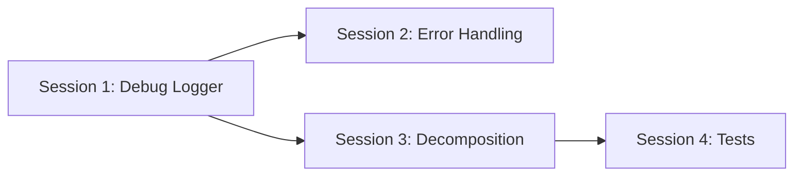

# Pre-Launch Implementation Guide

**Goal:** Harden the Switchboard plugin for BRAT release across 4 focused sessions.

---

## Session 1: Debug Logger System

**Effort:** ~1 hour | **Risk:** Low | **Impact:** High (enables all future debugging)

### Overview

Create a centralized `Logger` utility that gates all `console.log` output behind a `debugMode` setting toggle. When off, users see nothing in the console. When on, every service emits structured, prefixed logs.

### Proposed Changes

---

#### [NEW] [Logger.ts](file:///c:/Users/bwales/projects/obsidian-plugins/switchboard/src/services/Logger.ts)

A singleton-style logger that all services use instead of raw `console.log`.

```typescript
/**
 * Centralized logger for Switchboard
 * All console output flows through here and is gated by debugMode
 */
export class Logger {
    private static debugMode: boolean = false;

    /** Called once during plugin load */
    static setDebugMode(enabled: boolean) {
        this.debugMode = enabled;
    }

    /** Debug-only log (hidden unless debug mode is on) */
    static debug(prefix: string, ...args: unknown[]) {
        if (this.debugMode) {
            console.log(`[Switchboard:${prefix}]`, ...args);
        }
    }

    /** Always-visible warning (user-impacting issues) */
    static warn(prefix: string, ...args: unknown[]) {
        console.warn(`[Switchboard:${prefix}]`, ...args);
    }

    /** Always-visible error (something broke) */
    static error(prefix: string, ...args: unknown[]) {
        console.error(`[Switchboard:${prefix}]`, ...args);
    }

    /** Always-visible info (plugin load/unload only) */
    static info(prefix: string, ...args: unknown[]) {
        console.log(`[Switchboard:${prefix}]`, ...args);
    }
}
```

**Design decisions:**
- `debug()` is gated — silent unless toggle is on
- `error()` and `warn()` are **always visible** — errors should never be hidden
- `info()` is always visible but reserved for critical lifecycle events only (load/unload)
- Consistent `[Switchboard:ServiceName]` prefix makes filtering easy in DevTools
- Static class, no instantiation needed — simple import and use

---

#### [MODIFY] [types.ts](file:///c:/Users/bwales/projects/obsidian-plugins/switchboard/src/types.ts)

Add `debugMode` to `SwitchboardSettings` interface and defaults:

```diff
 export interface SwitchboardSettings {
+    /** Enable verbose console logging for debugging */
+    debugMode: boolean;
     lines: SwitchboardLine[];
     // ... rest unchanged
 }

 export const DEFAULT_SETTINGS: SwitchboardSettings = {
+    debugMode: false,
     lines: [],
     // ... rest unchanged
 };
```

---

#### [MODIFY] [main.ts](file:///c:/Users/bwales/projects/obsidian-plugins/switchboard/src/main.ts)

Initialize logger in `onload()`:

```diff
+import { Logger } from "./services/Logger";

 async onload() {
+    Logger.setDebugMode(this.settings.debugMode);
-    console.log("Switchboard: Loading plugin...");
+    Logger.info("Core", "Loading plugin...");
     // ... rest of onload
 }
```

---

#### [MODIFY] [SwitchboardSettingTab.ts](file:///c:/Users/bwales/projects/obsidian-plugins/switchboard/src/settings/SwitchboardSettingTab.ts)

Add a toggle in the settings tab (under a new "Advanced" section at the bottom):

```typescript
// === Advanced Section ===
containerEl.createEl("h3", { text: "🔧 Advanced" });

new Setting(containerEl)
    .setName("Debug mode")
    .setDesc("Enable verbose logging to the developer console (Ctrl+Shift+I). Useful for troubleshooting.")
    .addToggle(toggle => toggle
        .setValue(this.plugin.settings.debugMode)
        .onChange(async (value) => {
            this.plugin.settings.debugMode = value;
            Logger.setDebugMode(value);
            await this.plugin.saveSettings();
        }));
```

---

#### [MODIFY] All services — Replace `console.log` with `Logger.debug`

**35 `console.log` calls across 6 files** need replacing. File-by-file:

| File | `console.log` count | Prefix to use |
|---|---:|---|
| `main.ts` | 9 | `"Core"` |
| `SessionLogger.ts` | 14 | `"Session"` |
| `CircuitManager.ts` | 5 | `"Circuit"` |
| `WireService.ts` | 3 | `"Wire"` |
| `AudioService.ts` | 2 | `"Audio"` |
| `SwitchboardSettingTab.ts` | 3 | `"Settings"` |

**Rules for conversion:**
- `console.log(...)` → `Logger.debug(prefix, ...)` (most calls)
- `console.error(...)` → `Logger.error(prefix, ...)` (keep always visible)
- Plugin load/unload messages → `Logger.info("Core", ...)` (keep always visible)

---

## Session 2: Error Handling Audit

**Effort:** ~1 hour | **Risk:** Low | **Impact:** High (prevents plugin crashes)

### Overview

Wrap every risky operation in try-catch with user-facing `Notice` messages for errors. The goal: **no uncaught error should crash the plugin**.

### Current State

| File | Try-catch blocks | Unprotected risky operations |
|---|---:|---|
| `SessionLogger.ts` | 3 | File creation, daily note append |
| `WireService.ts` | 2 | Chronos API, Call Waiting file I/O |
| `CircuitManager.ts` | 0 | CSS injection, DOM traversal, folder collapse |
| `AudioService.ts` | 1 | Audio file loading, Web Audio API |
| `SwitchboardSettingTab.ts` | 1 | Chronos task parsing |
| `main.ts` | 0 | Landing page open, file creation, settings save |

### Proposed Changes

---

#### [MODIFY] [main.ts](file:///c:/Users/bwales/projects/obsidian-plugins/switchboard/src/main.ts)

Wrap these methods in try-catch:

| Method | Risk | What could fail |
|---|---|---|
| `patchIn()` | Settings save, CSS injection, session start, file open | Landing page not found, vault locked |
| `disconnect()` | Settings save, session end, daily note write | File I/O failure, log file corruption |
| `openCallWaiting()` | File create/open | Vault permissions, path invalid |

Pattern:

```typescript
async patchIn(line: SwitchboardLine) {
    try {
        // ... existing logic
    } catch (e) {
        Logger.error("Core", "Failed to patch in:", e);
        new Notice("Switchboard: Failed to patch in. Check console for details.");
    }
}
```

---

#### [MODIFY] [CircuitManager.ts](file:///c:/Users/bwales/projects/obsidian-plugins/switchboard/src/services/CircuitManager.ts)

Currently **zero try-catch blocks**. Wrap:

| Method | What could fail |
|---|---|
| `activate()` | Style element creation, DOM manipulation |
| `focusFolders()` | File explorer API access, internal Obsidian API changes |

> [!IMPORTANT]
> `focusFolders()` accesses `(fileExplorer as any).fileItems` — this is an undocumented Obsidian internal. If Obsidian updates break this API, it must fail silently rather than crash the plugin.

---

#### [MODIFY] [AudioService.ts](file:///c:/Users/bwales/projects/obsidian-plugins/switchboard/src/services/AudioService.ts)

Wrap sound playback in try-catch. Audio failures should **never** surface to the user — they should just silently fail:

```typescript
async playPatchIn() {
    try {
        // ... existing logic
    } catch (e) {
        Logger.debug("Audio", "Sound playback failed (non-critical):", e);
        // Silently fail — audio is optional
    }
}
```

---

#### [MODIFY] [WireService.ts](file:///c:/Users/bwales/projects/obsidian-plugins/switchboard/src/services/WireService.ts)

Add top-level try-catch in the polling loop (`checkChronosTasks`) so a single bad task doesn't kill the entire wire service:

```typescript
private checkChronosTasks() {
    try {
        // ... existing logic
    } catch (e) {
        Logger.error("Wire", "Error checking Chronos tasks:", e);
        // Don't stop polling — try again next interval
    }
}
```

---

## Session 3: main.ts Decomposition

**Effort:** ~45 min | **Risk:** Low (pure refactor, no behavior change) | **Impact:** Medium

### Overview

Extract two focused services from `main.ts` to bring it under 600 lines and make the extracted logic independently testable.

### Proposed Changes

---

#### [NEW] [StatusBarManager.ts](file:///c:/Users/bwales/projects/obsidian-plugins/switchboard/src/services/StatusBarManager.ts)

Extract from `main.ts`:
- `updateStatusBar()` (~40 lines)
- `startTimerUpdates()` / `stopTimerUpdates()` (~20 lines)
- `showStatusBarMenu()` (~80 lines)
- `formatDuration()` (~10 lines)
- `statusBarItem` field
- `timerInterval` field

**Estimated: ~150 lines**

```typescript
export class StatusBarManager {
    private plugin: SwitchboardPlugin;
    private statusBarItem: HTMLElement | null = null;
    private timerInterval: ReturnType<typeof setInterval> | null = null;

    constructor(plugin: SwitchboardPlugin) { ... }
    
    initialize(): void { /* addStatusBarItem, event listener */ }
    update(): void { /* draw current state */ }
    startTimer(): void { ... }
    stopTimer(): void { ... }
    showMenu(event: MouseEvent): void { /* context menu */ }
    destroy(): void { /* cleanup */ }
    private formatDuration(minutes: number): string { ... }
}
```

---

#### [NEW] [TimerManager.ts](file:///c:/Users/bwales/projects/obsidian-plugins/switchboard/src/services/TimerManager.ts)

Extract from `main.ts`:
- `scheduleAutoDisconnect()` (~20 lines)
- `cancelAutoDisconnect()` (~5 lines)
- `startBreakReminderTimer()` (~15 lines)
- `stopBreakReminderTimer()` (~5 lines)
- `autoDisconnectTimer` field
- `breakReminderTimer` field

**Estimated: ~80 lines**

```typescript
export class TimerManager {
    private plugin: SwitchboardPlugin;
    private autoDisconnectTimer: ReturnType<typeof setTimeout> | null = null;
    private breakReminderTimer: ReturnType<typeof setTimeout> | null = null;

    constructor(plugin: SwitchboardPlugin) { ... }
    
    scheduleAutoDisconnect(endTime: Date): void { ... }
    cancelAutoDisconnect(): void { ... }
    startBreakReminder(): void { ... }
    stopBreakReminder(): void { ... }
    destroy(): void { /* cancel all timers */ }
}
```

---

#### [MODIFY] [main.ts](file:///c:/Users/bwales/projects/obsidian-plugins/switchboard/src/main.ts)

- Import and initialize `StatusBarManager` and `TimerManager` in `onload()`
- Replace all direct calls with delegation (e.g., `this.statusBarManager.update()`)
- Remove extracted methods and fields

**Expected result:** `main.ts` drops from **724 → ~500 lines**

---

## Session 4: Targeted Unit Tests

**Effort:** ~1.5 hours | **Risk:** None (additive only) | **Impact:** High

### Overview

Set up Vitest and write focused tests on the **riskiest pure logic functions**. No DOM testing, no mocking Obsidian — just pure logic.

### Test Framework Setup

#### [NEW] [vitest.config.ts](file:///c:/Users/bwales/projects/obsidian-plugins/switchboard/vitest.config.ts)

```typescript
import { defineConfig } from "vitest/config";

export default defineConfig({
    test: {
        include: ["test/**/*.test.ts"],
        environment: "node",
    },
});
```

Add to `package.json`:
```diff
 "scripts": {
+    "test": "vitest run",
+    "test:watch": "vitest",
 }
```

Dev dependency: `npm install -D vitest`

---

### Test Files

#### [NEW] [test/types.test.ts](file:///c:/Users/bwales/projects/obsidian-plugins/switchboard/test/types.test.ts)

Test `generateId()`:
- Basic slug generation (`"Math 140"` → `"math-140"`)
- Special characters stripped
- Leading/trailing hyphens removed
- Empty string handling

**~20 lines, ~5 tests**

---

#### [NEW] [test/logger.test.ts](file:///c:/Users/bwales/projects/obsidian-plugins/switchboard/test/logger.test.ts)

Test `Logger`:
- `debug()` suppressed when `debugMode` is off
- `debug()` outputs when `debugMode` is on
- `error()` always outputs regardless of mode
- `warn()` always outputs regardless of mode

**~40 lines, ~6 tests**

---

#### [NEW] [test/timer-manager.test.ts](file:///c:/Users/bwales/projects/obsidian-plugins/switchboard/test/timer-manager.test.ts)

Test `TimerManager` (after Session 3 extraction):
- Auto-disconnect schedules correctly for future times
- Auto-disconnect skips past times
- Break reminder restarts after firing
- `destroy()` cancels all timers

**~60 lines, ~6 tests** (uses `vi.useFakeTimers()`)

---

#### [NEW] [test/status-bar-manager.test.ts](file:///c:/Users/bwales/projects/obsidian-plugins/switchboard/test/status-bar-manager.test.ts)

Test `StatusBarManager.formatDuration()`:
- Minutes only (`45` → `"45m"`)
- Hours and minutes (`90` → `"1h 30m"`)
- Exact hours (`120` → `"2h"`)
- Zero minutes (`0` → `"0m"`)

**~30 lines, ~4 tests**

---

### Verification Plan

#### Automated Tests

```bash
# After Session 1 (Logger):
npm run build          # Confirm no compilation errors

# After Session 4 (Tests):
npm install -D vitest  # Install test framework
npx vitest run         # Run all tests — expect all green
```

#### Manual Verification

**Session 1 (Debug Logger):**
1. Open Obsidian with Switchboard loaded
2. Open Settings → Switchboard → "Advanced" section
3. Confirm "Debug mode" toggle exists and defaults to **off**
4. Open DevTools (Ctrl+Shift+I) → Console tab
5. Patch into a Line → Confirm **no** console output visible
6. Turn on debug mode in settings
7. Disconnect and patch in again → Confirm `[Switchboard:Core]`, `[Switchboard:Circuit]`, `[Switchboard:Session]` messages appear
8. Turn debug mode off → Confirm messages stop

**Session 2 (Error Handling):**
1. Create a Line with a non-existent landing page path
2. Patch in → Confirm Notice appears ("Landing page not found") instead of unhandled error
3. If Chronos is not installed, confirm no errors in console related to WireService
4. Brad: Can you suggest any other failure scenarios you've encountered?

**Session 3 (Decomposition):**
1. `npm run build` — passes with no errors
2. All existing functionality works identically (patch in, disconnect, status bar, timers, break reminders)
3. Status bar context menu still works
4. Auto-disconnect still fires at scheduled time

---

## Session Order & Dependencies



- **Session 1 first** — Logger is used by Sessions 2 and 3
- **Session 2 and 3** can happen in either order after Session 1
- **Session 4 last** — Tests target the decomposed services from Session 3

---

## Files Changed Summary

| Session | New Files | Modified Files |
|---|---|---|
| **1: Debug Logger** | `Logger.ts` | `types.ts`, `main.ts`, `SwitchboardSettingTab.ts`, `CircuitManager.ts`, `WireService.ts`, `SessionLogger.ts`, `AudioService.ts` |
| **2: Error Handling** | — | `main.ts`, `CircuitManager.ts`, `AudioService.ts`, `WireService.ts` |
| **3: Decomposition** | `StatusBarManager.ts`, `TimerManager.ts` | `main.ts` |
| **4: Tests** | `vitest.config.ts`, `test/types.test.ts`, `test/logger.test.ts`, `test/timer-manager.test.ts`, `test/status-bar-manager.test.ts` | `package.json` |
