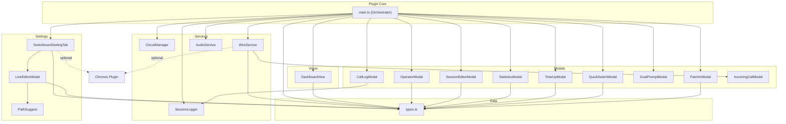

# System Dependency Matrix

> **Last Updated:** 2026-02-08 | **Purpose:** Bird's-eye view of which systems depend on which others

---

## How to Read This

- **Rows** = the system that *depends on* something
- **Columns** = the system being *depended upon*
- ● = direct import dependency

---

## Service → Service Dependencies

| Depends On → ↓ Uses | CircuitManager | WireService | SessionLogger | AudioService |
|---|---|---|---|---|
| **CircuitManager** | | | | |
| **WireService** | | | | |
| **SessionLogger** | | | | |
| **AudioService** | | | | |

> **Key Insight:** Services have **zero cross-dependencies**. Each service imports only from `types.ts` and/or `main.ts` (via `type import`). This is excellent architecture — services are fully decoupled.

### Key Takeaways

| Highest Fan-In (most depended upon) | Count |
|---|---|
| **types.ts** | 17 files import from it |
| **main.ts** (via `type import`) | 12 files import the plugin type |

| Highest Fan-Out (most dependencies) | Count |
|---|---|
| **main.ts** | Imports all 4 services, all 9 modals, settings tab, dashboard view, types |
| **SwitchboardSettingTab** | Imports plugin type, LineEditorModal, types |
| **WireService** | Imports plugin type, types, IncomingCallModal |

> [!IMPORTANT]
> **`main.ts` is the sole orchestrator** — it is the only file that references all other modules. All coordination flows through the plugin class. This is a clean hub-and-spoke architecture.

---

## main.ts → All Dependencies

`main.ts` imports from every other layer. Here is the full fan-out:

| Category | Imports |
|---|---|
| **Types** | `SwitchboardSettings`, `DEFAULT_SETTINGS`, `SwitchboardLine` |
| **Services** | `CircuitManager`, `WireService`, `SessionLogger`, `AudioService` |
| **Modals** | `PatchInModal`, `CallLogModal`, `OperatorModal`, `TimeUpModal`, `StatisticsModal`, `SessionEditorModal`, `GoalPromptModal`, `QuickSwitchModal` |
| **Settings** | `SwitchboardSettingTab` |
| **Views** | `DashboardView`, `DASHBOARD_VIEW_TYPE` |

**Total: 17 imports** — every module in the codebase.

---

## Modal → Service/Plugin Dependencies

| Modal | Imports From |
|---|---|
| **CallLogModal** | `SessionLogger` (SessionInfo type) |
| **GoalPromptModal** | *(none — standalone)* |
| **IncomingCallModal** | *(none — standalone, exports types)* |
| **OperatorModal** | `main.ts` (plugin type), `types.ts` |
| **PatchInModal** | `types.ts` |
| **QuickSwitchModal** | `types.ts` |
| **SessionEditorModal** | `main.ts` (plugin type), `types.ts` |
| **StatisticsModal** | `main.ts` (plugin type), `types.ts` |
| **TimeUpModal** | `main.ts` (plugin type), `types.ts` |

---

## Settings → Dependencies

| Settings File | Imports From |
|---|---|
| **SwitchboardSettingTab** | `main.ts` (plugin type), `LineEditorModal`, `types.ts` |
| **LineEditorModal** | `types.ts`, `PathSuggest` (`FolderSuggest`, `FileSuggest`) |
| **PathSuggest** | *(Obsidian API only — no project imports)* |

---

## View → Dependencies

| View | Imports From |
|---|---|
| **DashboardView** | `main.ts` (plugin type), `types.ts` |

---

## External Plugin Dependencies

| External Plugin | Used By | Coupling Level |
|---|---|---|
| **Chronos** | `WireService`, `SwitchboardSettingTab` | 🟡 Soft — accessed via `app.plugins.getPlugin()`, wrapped in try-catch. Gracefully degrades if Chronos is absent. |

---

## System Dependency Diagram

---

## Observations & Notes

### ✅ Strengths
- **Zero service-to-service coupling** — Services are fully independent. Any service can be modified or replaced without affecting others.
- **Clean hub-and-spoke architecture** — `main.ts` is the sole coordinator. No spaghetti dependencies.
- **Soft external coupling** — Chronos integration is wrapped in try-catch and gracefully degrades.
- **Most modals are standalone** — 6 of 9 modals only depend on `types.ts`, making them easy to test in isolation.

### ⚠️ Observations
- **`main.ts` is a God Object** (724 lines, 17 imports) — It currently handles orchestration, state management, UI coordination, timer management, and status bar updates. If the plugin grows, this is the first file that should be decomposed.
- **`WireService` is the most complex service** (552 lines) — It handles Chronos polling, native scheduled blocks, snooze timers, call waiting file I/O, and incoming call triggers. It would benefit from decomposition if Chronos integration features expand.
- **No dependency injection** — Services are constructed directly in `onload()`. This makes testing harder since services can't be mocked without refactoring.
